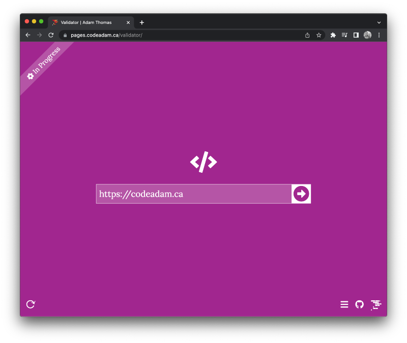

# A Basic Sample Assignment using the W3C Validator

A PHP and JavaScript tool to validate a webpage against a variety of requirements. 

> The Validator tool is available to view at:  
> https://pages.codeadam.ca/validator

***

# Repo Resources

* [W3C Markup Validator](https://validator.w3.org/)
* [W3C CSS Validator](https://jigsaw.w3.org/css-validator/)

 

